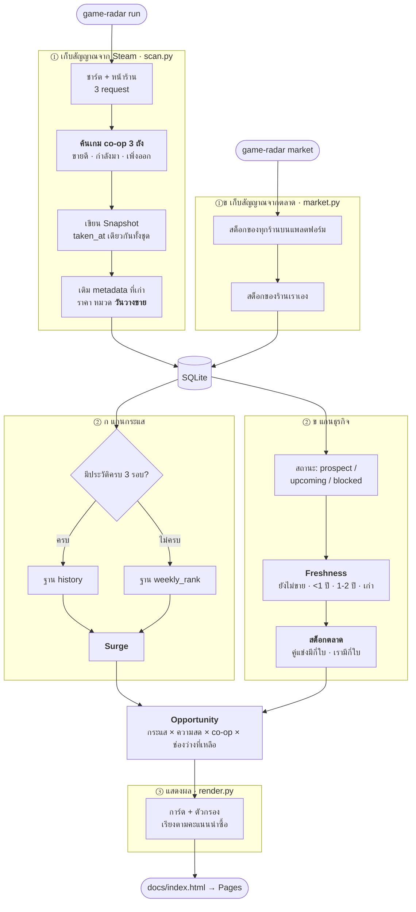

# Game Radar

จับเกม Steam ที่กำลังพุ่ง แล้วคัดเฉพาะตัวที่เอาไปปล่อยเช่าไอดีได้ ออกมาเป็นหน้า dashboard

**หน้า dashboard สด:** https://dolopert.github.io/TrendGame/docs/index.html

คำศัพท์ที่ใช้ทั้งโปรเจกต์อยู่ที่ [CONTEXT.md](./CONTEXT.md) — อ่านก่อนแก้โค้ด

เครื่องมือนี้ตอบคำถามเดียว: **"ควรเอาเงินไปซื้อไอดีเกมไหนก่อนที่ร้านอื่นจะซื้อ"**
ไม่ใช่ "เกมไหนกำลังดัง" — เกมที่ดังแล้วและคู่แข่งสต็อกไว้ 50 ไอดี มีค่าเป็นศูนย์สำหรับร้านที่เพิ่งเข้าตลาด

## ใช้ยังไง

รันวันละครั้ง (เก็บข้อมูล + สร้าง dashboard ในคำสั่งเดียว):

```bash
uv run --project game-radar game-radar run
```

**เก็บสต็อกของตลาดเช่า — ควรรันทุกวันแม้วันที่ไม่ได้สแกน Steam:**

```bash
uv run --project game-radar game-radar market
```

คำสั่งนี้เบามาก ยิงไม่กี่ request แต่ขาดไปวันหนึ่งคือเสียจุดเปรียบเทียบไปหนึ่งจุดถาวร
มันคือแหล่งเดียวที่จะทำให้แบ็คเทสของจริงเกิดขึ้นได้ในอีกไม่กี่สัปดาห์

แยกเป็นขั้น ๆ ถ้าต้องการ:

```bash
uv run --project game-radar game-radar scan
```

```bash
uv run --project game-radar game-radar dash
```

ดูอันดับเร็ว ๆ ในเทอร์มินัลโดยไม่ต้องเปิดเบราว์เซอร์:

```bash
uv run --project game-radar game-radar top -n 15
```

เปิด dashboard: ใช้ preview config ชื่อ `game-radar` (พอร์ต 5501) หรือเปิดไฟล์
`out/dashboard.html` ตรง ๆ ก็ได้

### อัปเดตหน้าเว็บที่ deploy ไว้

หน้าที่ https://dolopert.github.io/TrendGame/docs/index.html มาจาก `docs/index.html` ซึ่ง commit ไว้ในรีโป
GitHub Pages ตั้ง source เป็น branch `main` โฟลเดอร์ `/ (root)` ทั้งรีโปจึงถูก publish
หน้า dashboard เลยอยู่ที่ path `/docs/index.html` ไม่ใช่ที่รากของเว็บ อัปเดตด้วยการสร้างทับแล้วพุช:

```bash
uv run --project game-radar game-radar scan
```

```bash
uv run --project game-radar game-radar dash --out game-radar/docs/index.html
```

ข้อควรรู้: `docs/index.html` เป็นไฟล์ที่ **สร้างขึ้นมา** ไม่ใช่ไฟล์ที่แก้ด้วยมือ
แก้หน้าตาให้ไปแก้ template ใน `src/game_radar/render.py` แทน

## ระบบทำงานยังไง

มีสองสายข้อมูลเข้า: **สัญญาณจาก Steam** (เกมกำลังมาไหม) กับ **สัญญาณจากตลาดเช่าจริง**
(ตลาดรู้แล้วหรือยัง) — สายที่สองคือสิ่งที่ v1 ไม่มี และเป็นเหตุผลที่ v1 ทำนายไม่ได้

Surge กับแกนธุรกิจยังคำนวณแยกกันเหมือนเดิม เพื่อให้ดีบักได้ว่าพังตรงไหน
แต่ตอนนี้มาบรรจบที่ **Opportunity** ก่อนถึงหน้าเว็บ



### อ่านผังนี้ยังไง

| จุด | ทำไมถึงออกแบบแบบนั้น |
|---|---|
| ชาร์ต 2 ตัวมาก่อน | ได้ CCU และอันดับของ ~150 เกมด้วย 2 request แทนที่จะยิงทีละเกม 150 ครั้ง |
| `taken_at` เดียวกันทั้งชุด | ถ้าแต่ละเกมมีเวลาต่างกัน จะเอา snapshot มาเทียบกันไม่ได้ |
| แคช metadata 3 วัน | `appdetails` ถูก rate limit หนักสุดในบรรดา endpoint ทั้งหมด และราคา/หมวดแทบไม่เปลี่ยนรายวัน |
| แยกสองแกนที่ ② | เหตุผลอยู่ย่อหน้าบนผัง |
| เก็บสต็อกตลาดแยกคำสั่ง | คำสั่ง `market` เบามาก รันได้ทุกวันแม้วันที่ไม่สแกน Steam — ความต่อเนื่องสำคัญกว่าความละเอียด |
| ตัวกรองอยู่ฝั่งเบราว์เซอร์ | หน้าเว็บเป็นไฟล์นิ่ง ๆ ไม่มี server กรองให้ กดแล้วต้องเปลี่ยนทันที |

## ข้อมูลมาจากไหน

ทุก endpoint เป็นของฟรี ไม่ต้องใช้ API key และไม่มีอะไรต้องใส่ `.env`

| endpoint | ได้อะไร | ยิงกี่ครั้งต่อรอบ |
|---|---|---|
| `ISteamChartsService/GetMostPlayedGames` | 100 อันดับ + **อันดับสัปดาห์ก่อน** | 1 |
| `ISteamChartsService/GetGamesByConcurrentPlayers` | CCU สด 100 เกม | 1 |
| `store/api/featuredcategories` | ลดราคา / เกมใหม่ / ขายดี / กำลังมา | 1 |
| `ISteamUserStats/GetNumberOfCurrentPlayers` | CCU รายตัว (เฉพาะเกมนอกชาร์ต) | ~60 |
| `store/api/appdetails` | ราคา หมวดหมู่ แนว ปก วันวางขาย | เท่าจำนวนเกมที่ metadata เก่า |

`appdetails` ถูก Steam จำกัดราว 200 ครั้งต่อ 5 นาที โค้ดจึงหน่วง 1.5 วินาทีต่อครั้ง
และแคชผลไว้ 3 วัน (ตั้งใหม่ได้ที่ `db.stale_appids`) รอบแรกจึงกินเวลาราว 4 นาที
รอบถัด ๆ ไปจะเร็วกว่ามาก

## แบ็คเทสกับตลาดจริง — และสิ่งที่มันหักล้าง

ดึงแค็ตตาล็อกร้านเช่าจริงบน 499k-network (36 เกม 290 ไอดี) มาเทียบกับอันดับที่ v1 ให้:

**Spearman rank correlation = −0.07** คือ **ไม่มีความสัมพันธ์กันเลย** เกมที่ตลาดลงทุนหนักสุด
(R.E.P.O. 50 ไอดี) v1 จัดไว้อันดับ 71 ส่วนเกมที่ v1 จัดอันดับต้น ๆ ตลาดแทบไม่แตะ

สามอย่างที่ v1 เข้าใจผิด และแก้แล้วใน v2:

| v1 คิดว่า | ข้อมูลจริงบอกว่า |
|---|---|
| single-player ปล่อยเช่าง่ายกว่า = ข้อดี | **98% ของไอดีที่ตลาดสต็อกอยู่กับเกมที่มี Multi-player** ส่วน single ล้วนได้ 1% |
| CCU/อันดับ = ตัวชี้วัดดีมานด์ | วัด "ฐานผู้เล่นใหญ่" ซึ่งคนละเรื่องกับ "กลุ่มเพื่อนอยากเล่นด้วยกัน" |
| วันวางขายไม่สำคัญ | **8 ใน 12 เกมที่ตลาดสต็อกหนักสุดออกภายใน 18 เดือน** |
| เกมยังไม่วางขาย = ตัดทิ้ง | มันคือของที่ยังไม่มีใครสต็อกได้เลย = ช่องว่างที่ชัดที่สุด |

สิ่งเดียวที่รอด: ช่วงราคา ฿100-600 — 75% ของแค็ตตาล็อกจริงอยู่ในช่วงนี้ (ค่ากลาง ฿342)

**ข้อควรระวังที่สำคัญที่สุด:** การตรงหรือไม่ตรงกับแค็ตตาล็อกปัจจุบันของคู่แข่ง บอกได้แค่ว่า
*มองถูกหมวดไหม* ไม่ได้บอกว่า *จะเจอเกมถัดไปก่อนเขาไหม* — อันนั้นต้องรอให้ `market` สะสมข้อมูล
ไปข้างหน้าจริงสองสามสัปดาห์ แล้วดูว่าสัญญาณจาก Steam ของเรามาก่อนที่คู่แข่งจะเพิ่มสต็อกหรือเปล่า

## เรื่องที่ต้องเข้าใจก่อนเชื่อตัวเลข

**คะแนนกระแสมีสองเกรด** และ dashboard บอกไว้ตรงการ์ดทุกใบ:

- ช่วง 3 วันแรกยังไม่มีประวัติของตัวเอง คะแนนจึงมาจาก `last_week_rank`
  ที่ Steam แถมมากับชาร์ต — หยาบกว่า แต่มีให้ใช้ตั้งแต่วันแรกเลยไม่ต้องรอ
- ตั้งแต่รอบที่ 4 เป็นต้นไป ระบบสลับไปเทียบกับค่ากลางของตัวเกมเองอัตโนมัติ ซึ่งแม่นกว่ามาก

**"เข้าชาร์ตใหม่" ดูจากอันดับสัปดาห์ก่อนที่เกิน 100** ไม่ใช่จากการที่ไม่มีอันดับ
— ตอนแรกเข้าใจว่า Steam จะไม่ส่ง `last_week_rank` มาให้เกมที่สัปดาห์ก่อนยังไม่ติดชาร์ต
แต่พอยิงจริงพบว่ามันส่งมาเสมอ และส่งค่าที่เกิน 100 ได้ด้วย (เจอ 152 มาแล้ว)
เกมที่กระโดดจากนอกชาร์ตเข้ามาติด 100 อันดับคือสิ่งที่โปรเจกต์นี้ตั้งใจจะจับ

**โหมดผู้เล่นกลับด้านมาแล้วสองครั้ง** รอบแรกออกแบบว่าจะคัดเกมที่มี Multi-player ทิ้ง
ซึ่งจะคัด How to Fish (มีครบทั้ง Single/Multi/Co-op) ทิ้งเอง เลยเปลี่ยนเป็นแค่ป้ายกำกับ
รอบสองพอเทียบกับตลาดจริงพบว่าต้องกลับด้านอีกที — **การมี co-op คือเงื่อนไขเกือบบังคับ**
ไม่ใช่แค่ป้าย เพราะเกมที่เล่นคนเดียวล้วนกินส่วนแบ่งแค่ 1% ของไอดีทั้งตลาด

## ความเสี่ยงของโมเดลธุรกิจ

Steam Subscriber Agreement ไม่อนุญาตให้แชร์หรือให้เช่าบัญชี ไอดีถูกล็อกได้ถ้ามีคนรายงาน
เกมที่มี Online PvP เสี่ยงเพิ่มเพราะระบบ anti-cheat จับ IP ที่กระโดดไปมา
— dashboard ติดหมายเหตุนี้ไว้ที่การ์ดของเกมกลุ่มนั้นแล้ว ส่วนจะรับความเสี่ยงแค่ไหนเป็นการตัดสินใจของคุณ

## โครงสร้าง

```
src/game_radar/
  steam.py    ตัวห่อ Steam API — ไม่มี logic ธุรกิจ
  market.py   ตัวห่อ API ของแพลตฟอร์มร้านเช่า (สต็อกจริง)
  db.py       schema + คำสั่งอ่านเขียน SQLite
  scan.py     การเก็บข้อมูลหนึ่งรอบ (ทั้ง Steam และตลาด)
  score.py    Surge · Freshness · สต็อกตลาด → Opportunity
  render.py   สร้าง dashboard.html
  cli.py      คำสั่ง
data/         ฐานข้อมูล (gitignore)
out/          dashboard ที่สร้างแล้ว (gitignore)
```
